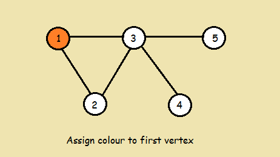
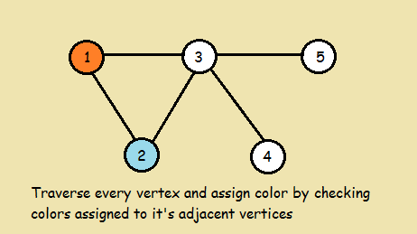
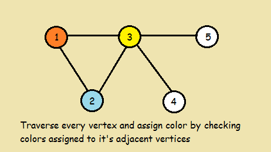
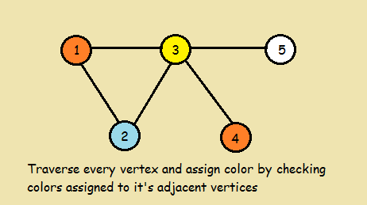
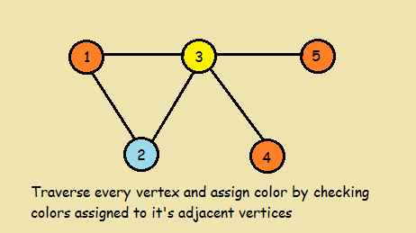

# Graph coloring implementation in C
## Discrete Math II project - School of Mathematics, Astronomy, Physics and Computing of the National University of Córdoba

### Definitions

#### Graph
A graph is a pair G = (V, E), where V is a set whose elements are called vertices, and E is a set of paired vertices, whose elements are called edges.

#### Graph coloring
Is a special case of graph labeling; it is an assignment of labels traditionally called "colours" to elements of a graph subject to certain constraints. In its simplest form, it is a way of coloring the vertices of a graph such that no two adjacent vertices share the same color; this is called a vertex coloring.

#### Chromatic Number
The smallest number of colors needed to color a graph G is called its chromatic number.

#### Bipartite Graph(Characterization)
A graph is bipartite if and only if it is 2-colourable, (i.e. its chromatic number is less than or equal to 2)

#### Remark
Colors will be represented with numbers instead of strings such as red, blue, orange,... . This is just for simplicity. The explanation and the implementation will follow this convention.

### Introduction
In the study of graph coloring problems in mathematics and computer science, a greedy coloring or sequential coloring is a coloring of the vertices of a graph formed by a greedy algorithm that considers the vertices of the graph in sequence and assigns each vertex its first available color. Greedy colourings can be found in linear time, but they do not in general use the minimum number of colors possible.
Different choices of the sequence of vertices will typically produce different colourings of the given graph, so much of the study of greedy colourings has concerned how to find a good ordering.

### Greedy algorithm
The following pseudocode describes how the greedy algorithm works (imagine that you have a list of 0,1,2,3,4,... of colours):
>1. Color first vertex with first colour
>2. Do the following for remaining V-1 vertices:  
>Consider the currently picked vertex  
>Colour it with the lowest numbered colour
>that has not been used on any previously colored vertices
>adjacent to it.  
>If all previously used colors appear on vertices adjacent to v, assign a new color to it .

#### Example










### The Project
The goal of the project was:
1. Design a suitable data structure for the graph representation, considering that the chosen design allows to do certain tasks on the graph with time complexity O(1).

2. Implement functions for create, destroy and copy the graph.
> ConstruccionDelGrafo() <= Creates the graph  
> DestruccionDelGrafo()  <= Destroys the graph  
> CopiarGrafo()  <= Copies the graph

3. Implement the Graph colouring greedy algorithm and a function that decide if a graph is bipartite or not.
> Greedy() <= Graph colouring greedy algorithm  
> Bipartito() <= Bipartite function

4. Implement a set of functions to extract data from the graph. Each function must have a time complexity O(1).
> NumeroDeVertices() <= Returns the number of vertices of the graph  
> NumeroDeLados() <= Returns the number of edges of the graph  
> NumeroDeColores() <= Returns the number of colours used in the graph colouring.

5. Implement a set of functions to extract data from the vertices. These functions must have a time complexity O(1).
> NombreDelVertice() <= Returns the real name of the vertex for the given index i.(index 0 means the first vertex, index 1 means the second vertex,... and so on)  
> ColorDelVertice() <= Returns the colour of the vertex for the given index i.(index 0 means the first vertex, index 1 means the second vertex,... and so on)  
> GradoDelVertice() <= Returns the degree (or valency) of the vertex for the given index i.(index 0 means the first vertex, index 1 means the second vertex,... and so on)  
> ColorJotaesimoVecino() <= Returns the colour of the jth neighbor to the ith vertex.  
> NombreJotaesimoVecino() <= Returns the name of the jth neighbor to the ith vertex.  

6. Implement a set of different vertex sorting functions, based on the qsort function (provided by the Standar C library) in order to achieve reasonable time complexity.
>OrdenNatural() <= This function sorts the vertices by the "real" name of the vertices.  
>OrdenWelshPowell() <= This function sorts the vertices according to the Welsh-Powell sorting (i.e sorts the vertices by its degree in a non-increasing order).  
>SwitchVertices() <= This function switches two vertices in the internal order of the graph.  
>RMBCnormal()  <= This function sorts the vertices by its colour. For example if the graph has 6 vertices and has a list of colours 0,2,1,0,1,1, then the RMBCnormal() will generate the order 0,0,1,1,1,2.  
>RMBCrevierte() <= Similiar as RMBCnormal() but sorts in the opposite way.For example if the graph has 6 vertices and has a list of colours 0,2,1,0,1,1, then the RMBCnormal() will generate the order 2,1,1,1,0.
>RMBCchicogrande() <= This function sorts the vertices by the number of repetitions of the color of the vertex. For example if the graph has 6 vertices and has a list of colours 0,2,1,0,1,1, then the RMBCchicogrande() will generate the order 2,0,0,1,1,1.  
>SwitchColores() <= This function Switches the colour of the vertices. EVERY vertex coloured with i will be coloured with j and vice versa.  

The declaration of the above functions are in the **Rii.h** file.

## How to run it
Inside the Wahlaan directory, compile the C code.
```
gcc -IWahlaan -Wall -Wextra -O3 -std=c99 *.c -o main
```
This will generate a file named **main**.

The project has a file called **basic_main.c**. This file reads from the stdin, makes a copy of the loaded graph and runs the greedy algorithm twice with different sorting functions. This is just an example that shows how to use the implemented functions.

There are several graphs inside the graph_example directory. Some of them have the wrong format (g1xx.txt), because they were used for testing purpose.  
The following command will pass the graph stored in **g213.txt** throughout the stdin.
```
./main < ../graph_examples/g213.txt
```
